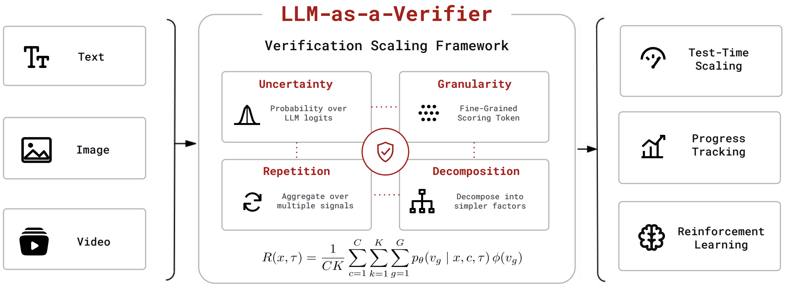
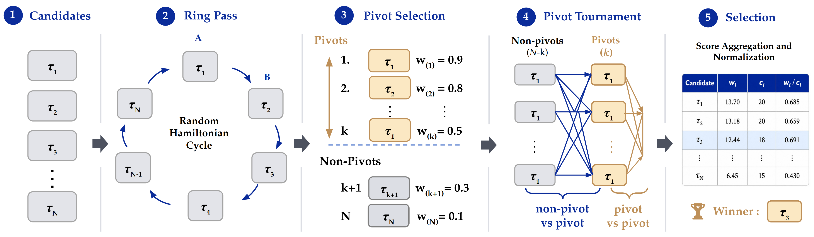

<!-- markdownlint-disable MD001 MD041 -->
<p align="center">
  <picture>
    
  </picture>
</p>

<h3 align="center">
Any modality, Many Applications, One Unified Verification Framework
</h3>

<p align="center">
| <a href="https://llm-as-a-verifier.ai"><b>Website</b></a> | <a href="https://docs.llm-as-a-verifier.ai"><b>Documentation</b></a> | <a href="https://arxiv.org/"><b>Paper</b></a> | <a href="https://blog.llm-as-a-verifier.ai"><b>Blog</b></a> | <a href="https://x.com/"><b>Twitter/X</b></a> | <a href="https://slack.llm-as-a-verifier.ai"><b>Slack</b></a> |
</p>

🔥 LLM-as-a-Verifier achieves state-of-the-art performance across agentic benchmarks, including Terminal-Bench V2, SWE-Bench Verified, MedAgentBench, RoboRewardBench and more. We call on the community to contribute more use cases to the project!


---

## Installation

```bash
pip install llm-verifier
```

To install the latest from a clone:

```bash
pip install -e .
```

---

## About

LLM-as-a-Verifier is a general-purpose framework that provides **fine-grained
feedback** for any agent. The key idea is simple: 1) use fine-grained scoring
granularity, 2) take the expectation over the full logprob distribution of LLM
score tokens, and 3) scale repeated evaluation and criteria decomposition. The
resulting fine-grained feedback can be used for test-time scaling, progress
tracking, and reinforcement learning.

<p align="center">
  
</p>

LLM-as-a-Verifier is accurate with:

- Fine-grained rewards from token-level logprobs instead of coarse discrete labels
- Scaled scoring granularity, repeated verification, and criteria decomposition
- Pairwise reward modeling with slot-bias cancellation via randomized ring passes
- Best-of-N selection that matches full round-robin accuracy

LLM-as-a-Verifier is efficient with:

- A **Probabilistic Pivot Tournament (PPT)** that selects the best of `N` rollouts in `O(Nk²)` verifier calls instead of the `O(N²)` of a full round-robin
- Committed score caches so results reproduce in seconds with no API key
- A single `llm_verifier.select(...)` call for best-of-N in one line

LLM-as-a-Verifier is flexible and easy to use with:

- One unified framework spanning many applications: coding agents, SWE tasks, medical agents, tool-use trajectories, and more
- Bundled benchmark criteria (Terminal-Bench, SWE-bench, MedAgentBench) or your own `*.md` / dict criteria
- Any verifier backend that exposes logprobs (Gemini 2.5 Flash via Vertex AI or the Gemini API)
- Drop-in adaptation to new tasks with Claude Code doing the wiring

### Key Results

| Benchmark | Scaffold · Model | Pass@1 | LLM-as-a-Verifier | Oracle |
|---|---|---|---|---|
| Terminal-Bench 2.0 | Capy · GPT-5.5 (×5) | 83.1% | **86.5%** | 92.1% |
| SWE-bench Verified | mini-swe-agent (×3) | 76.1% | **78.2%** | 84.4% |
| MedAgentBench | Claude-Opus-4.8 max-effort (×5) | 70.2% | **73.3%** | 75.0% |

---

## Quick Start

### Select the best of N rollouts

Given a task and a handful of agent trajectories, pick the best one in a few
lines of code:

```python
import llm_verifier

problem = "Fix the failing test in utils.py so the suite passes."
trajectories = [rollout_1, rollout_2, rollout_3, rollout_4, rollout_5]  # strings

result = llm_verifier.select(
    problem=problem,
    trajectories=trajectories,
    criteria="swe_bench",              # bundled criteria (or a path to your own .md)
    n_verifications=8,                 # repeated verifications per criterion
    pivots=2,                          # O(Nk²) tournament, k = pivots
)

print("Best rollout:", result.index)
print("Verifier calls:", result.n_comparisons)   # O(Nk²), not N²
```

`llm_verifier.select` samples a random ring pass (so the verifier's slot bias
cancels), picks the empirical leaders as pivots, scores only the directed pairs
the tournament needs, and returns the winner. `criteria` is a bundled benchmark
name (`"terminal_bench"`, `"swe_bench"`, `"medagentbench"`), a path to your own
`*.md` file, or a list of `{"id", "name", "description"}` dicts:

```python
result = llm_verifier.select(
    problem=problem,
    trajectories=trajectories,
    criteria=[
        {"id": "root_cause",   "name": "Root cause",   "description": "Did the agent fix the real cause?"},
        {"id": "verification", "name": "Verification", "description": "Did the agent confirm the fix?"},
    ],
    ground_truth_note="The hidden test checks utils.parse() on empty input.",
)
```

### Score a pair of trajectories directly

For the raw fine-grained reward over a pairwise comparison, drop down to the
reward model:

```python
from llm_verifier.fine_grained_reward import create_gemini_client, score_pair_criterion

client = create_gemini_client()
criterion = {"id": "overall", "name": "Overall", "description": "Did the agent solve the task?"}

r_a, r_b = score_pair_criterion(client, problem, trace_a, trace_b, criterion, ground_truth_note="")
print(r_a, r_b)   # fine-grained rewards in [0, 1]
```

---

## Reproducing the results

Run a benchmark by name (`python run.py` with no argument lists them):

```bash
python run.py terminal_bench
python run.py swe_bench
python run.py medagentbench
```

For example, `python run.py terminal_bench` reproduces the first row of the
table:

```
Method                               Score     Rate
------------------------------------------------------------------------
Pass@1                         74.00/89    83.1%
LLM-as-a-Verifier                 77/89    86.5%
Oracle (Bo5)                      82/89    92.1%
```

The cached verifier scores from the live runs above are committed, so these
reproduce the numbers in seconds and require **no API key**. Delete a cache file
(or change `--seed`) to score from scratch against Gemini. Override the defaults
on the command line if you like:

```bash
python run.py swe_bench --pivots 2 --n-verifications 8 --seed 0
```

Benchmarks are defined in `llm_verifier/benchmarks.py` — add or tweak one there.

---

## Adapt LLM-as-a-Verifier for your own use case

Use the verifier for your own task in three steps — Claude Code does the rest
(generates the criteria, writes a runner, and selects the best-of-N for you):

1. **Add your data.** Copy your agent trajectories into `data/task_name_trajs/`.
2. **Update naming.** Replace every `task_name` in
   [`add_new_benchmark.md`](add_new_benchmark.md) with the name of your task.
3. **Spin up Claude Code in this repo** (or Codex, or whatever you like — with
   permissions disabled) and paste the contents of `add_new_benchmark.md` to let
   it run.

---

## Layout

```
.
├── run.py                       # registry-driven launcher
├── llm_verifier/                  # the reusable framework (import llm_verifier)
│   ├── __init__.py              #   llm_verifier.select(...): best-of-N in one call
│   ├── benchmarks.py            #   BENCHMARKS registry (one Benchmark / launch)
│   ├── fine_grained_reward.py   #   R(t,τ): Gemini logprob scoring + cache
│   ├── pivot_tournament.py      #   PPT: O(Nk²) selection (Bradley-Terry)
│   ├── prompts.py               #   load criteria from criteria/*.md
│   ├── loaders.py               #   per-benchmark trajectory loaders
│   └── criteria/               #   bundled criteria + ground-truth notes (shipped)
│       ├── terminal_bench.md
│       ├── swe_bench.md
│       └── medagentbench.md
├── data/                        # agent trajectories per benchmark
├── cache/                       # cached verifier scores (committed)
└── results/                     # result tables (written after each run)
```

---

## How it works

Most agents already *know* how to solve their tasks — repeatedly sampling
rollouts (e.g. 100 per task) nearly solves Terminal-Bench. **The bottleneck is
verification**: knowing *which* rollout is correct, especially on long-horizon
tasks. Standard LLM-as-a-Judge scores too coarsely to separate strong
solutions, often collapsing them into a tie — **27% ties on Terminal-Bench
2.0**. LLM-as-a-Verifier removes that bottleneck with a fine-grained reward
(§1) aggregated by a budget-efficient tournament (§2).

### 1. Fine-grained reward

For a task `t`, criterion `c`, and two candidate trajectories `a` and `b`, the
verifier sees both in a single pairwise prompt and emits an integer score for
each in `<score_A>` / `<score_B>` tags. Rather than reading back a single
discrete label (as in LLM-as-a-Judge), LLM-as-a-Verifier extracts the
verifier's *logprobs* over the ordered score tokens and takes their
expectation, turning each judgement into a continuous reward. (A letter-based
scale is used so each score is a single token whose logprobs can be read off.)
The reward of trajectory `τ` on task `t` is

$$
R(t, \tau)
= \frac{1}{CK} \sum_{c=1}^{C} \sum_{k=1}^{K}
\sum_{g=1}^{G} p_{\theta}(v_g \mid t, c, \tau)\,\phi(v_g)
$$

- $C$ — number of evaluation criteria (decomposed in `llm_verifier/criteria/*.md`)
- $K$ — number of repeated verifications
- $G$ — number of ordered score tokens (granularity; here `G=20`, letters A–T)
- $p_{\theta}(v_g \mid t, c, \tau)$ — probability the verifier assigns to token $v_g$
- $\phi(v_g)$ — the scalar value of score token $v_g$

This lives in `llm_verifier/fine_grained_reward.py`.

### 2. Probabilistic Pivot Tournament

<p align="center">
  
</p>

To pick the best of `N` candidate trajectories, a round-robin tournament scores
all $\binom{N}{2}$ pairs — `O(N²)`. **PPT** reaches the same selection in three
steps, scoring directed pairs (candidate `a` in slot A, `b` in slot B):

1. **Ring pass.** Sample a uniformly random Hamiltonian cycle $\gamma$ over the
   `N` candidates and score the `N` adjacent pairs
   $\{(\gamma_t, \gamma_{t+1 \bmod N})\}$. Around the cycle every candidate sits
   in slot A exactly once and slot B exactly once, so the verifier's
   **slot bias cancels** in expectation.
2. **Pivot selection.** Rank candidates by their ring-pass mean preference
   $w_i / c_i$ and take the top-`k` as the pivot set `P` — the *empirical
   leaders*, so the remaining budget distinguishes the strongest candidates
   rather than re-scoring weak anchors.
3. **Pivot rounds.** Score every non-pivot-vs-pivot pair and every
   pivot-vs-pivot pair, aggregating all comparisons into the same $w_i, c_i$.
   The winner is $\arg\max_i w_i / c_i$; normalizing by $c_i$ removes the bias
   that pivots take part in more comparisons.

Each comparison's two fine-grained rewards $(R_a, R_b)$ become a soft win via
the Bradley-Terry model, $p(a \text{ beats } b) = \sigma(R_a - R_b)$. Total
comparisons: $N + k(N-k) + \binom{k}{2}$ — $O(Nk^2)$, linear in `N` for fixed
`k`. This lives in `llm_verifier/pivot_tournament.py`.

### 3. Verification as a scaling axis

Verification accuracy improves as you scale three independent dimensions of the
fine-grained reward — verification, not just generation, is a test-time scaling
axis:

- **Score granularity $G$** — finer score tokens give the decoder more room to
  project the model's belief, sharpening the separation between correct and
  incorrect solutions (accuracy rises from 73.1% at `G=1` to 77.5% at `G=20`).
- **Repeated verifications $K$** — averaging multiple independent passes reduces
  variance in the reward.
- **Criteria decomposition $C$** — splitting the evaluation into per-criterion
  judgements gives a more discriminative overall signal.
