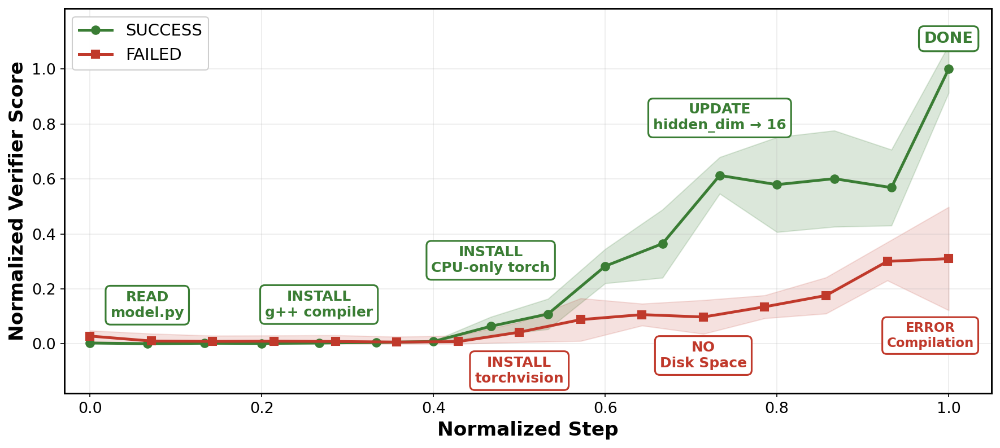

# Progress Tracking

The same fine-grained reward that ranks trajectories can score a trajectory *at every step*, not just at the end.
The verifier is shown the task and the numbered agent steps, and asked at each checkpoint whether the agent's current state would already satisfy the task's hidden grader.
Each answer letter (A = 0% progress … T = 100%) is decoded as the expectation over the verifier's top-20 logprobs at the answer position, giving a continuous progress curve in [0, 1].
On successful trajectories the curve rises toward 1; on failing ones it plateaus or falls.

## Offline: `track`

`track` scores a finished trajectory.
One verifier call scores all checkpoints; `n_evaluations` repeats are averaged into the curve, so cost is `O(K)` calls regardless of trajectory length:

```python
import llm_verifier

result = llm_verifier.track(
    problem=problem,
    steps=agent_steps,       # one string per agent step (action + observed output)
    n_evaluations=16,      # repeats K; the curve is their mean
)

print(result.steps)          # checkpoint step numbers
print(result.scores)         # progress score after each step
print(result.final)          # score at the last checkpoint
```

By default the interior steps `2 .. T-1` are scored (the first and last step anchor the scale); pass `checkpoint_steps` (1-indexed) to choose your own checkpoints.

The curve separates runs long before the grader does.
Below, two **Terminus 2** runs of the Terminal-Bench 2 task **`pytorch-model-cli`** (Gemini 2.5 Pro base model, K=16): the successful run stays near 0 while it reads the code and installs the toolchain, climbs as the right artifacts appear, and peaks once its verification passes — the failed run of the same task hits a disk-space wall, plateaus on a broken compilation, and never catches up.
Bands are ±1 std over the K repeats; steps and scores are normalized to [0, 1].



Reproduce this figure from the repository with (`--plot-only` renders the
committed curves without an API key; drop it to re-score from the raw
trajectories in `data/tacking_examples/`):

```bash
python terminal_bench_progress.py --plot-only
```

## Online: `ProgressTracker`

`track` shows the verifier the whole trajectory per call, so earlier checkpoints could in principle be influenced by the visible ending.
For an agent that is **still running**, use `ProgressTracker`: each `update` scores only the steps taken so far, so the verifier structurally cannot peek at the future — at the cost of one scoring call per step per repeat:

```python
tracker = llm_verifier.ProgressTracker(problem, n_evaluations=4)

for step in agent_run():                 # as the agent executes
    score = tracker.update(step)         # progress in [0, 1] so far
    if tracker.steps[-1] >= 8 and score < 0.05:
        break                            # abandon a hopeless rollout early

result = tracker.result()                # same shape as track()'s
```

Use it to stop hopeless rollouts early or to decide when to branch or resample.

## Choosing between them

| | `track` (offline) | `ProgressTracker` (online) |
|---|---|---|
| When | trajectory is finished | agent is still running |
| Verifier sees | full trajectory per call | only the prefix so far |
| Cost for a T-step run | `n_evaluations` calls | `T × n_evaluations` calls |
| Future leakage | possible in principle | structurally impossible |

Both return a [`ProgressResult`](../references/api.md#progressresult) with `.steps`, `.scores`, `.per_rep_scores`, and `.final`.

```{tip}
Steps are plain strings — concatenate the agent's action and its observed output. Truncate very long observations yourself if needed.
```
